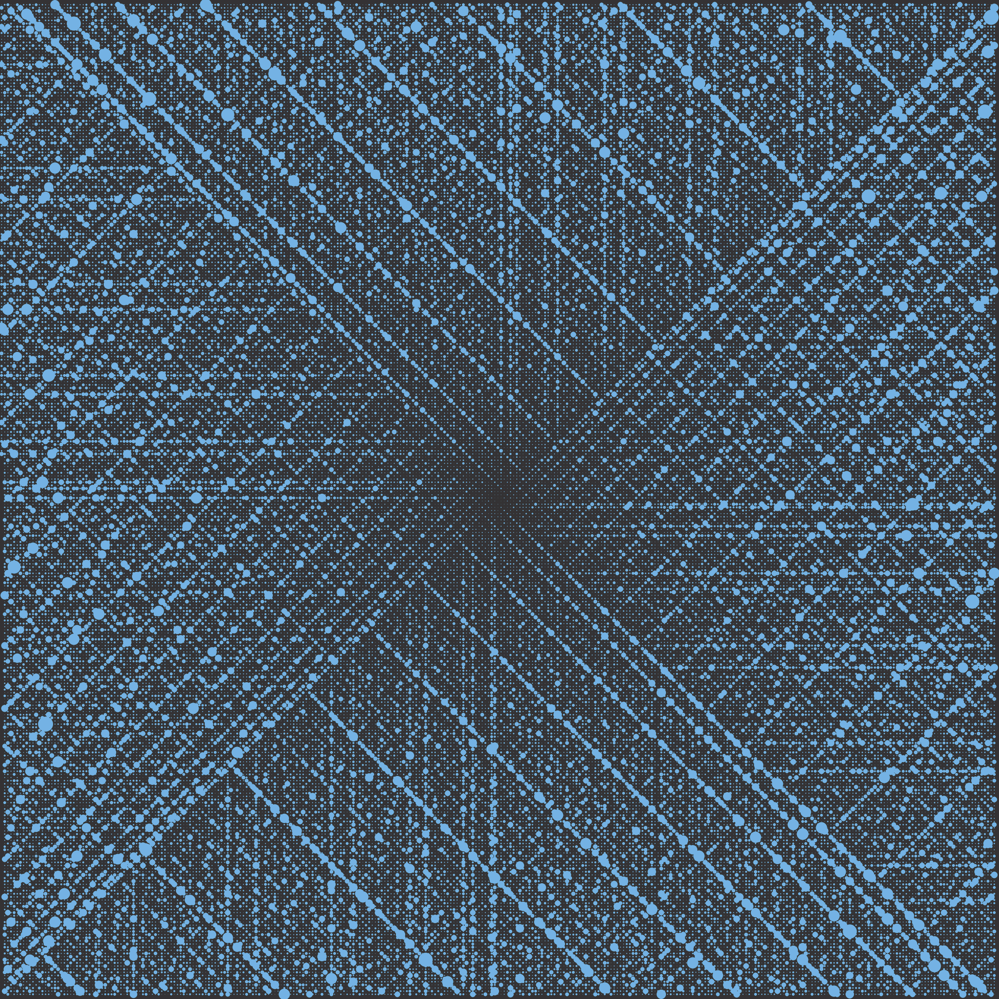

## $\zeta$ think first find axiom do action

🧠 &rarr; 📏 &rarr; ⚡

<table cellspacing="0" cellpadding="0" style="border: none;">
<tr>
<td>

</td>
<td>
<table cellspacing="0" cellpadding="0" style="border: none;">
<tr>
<td>

</td>
<td>

</td>
</tr>
<tr>
<td>

</td>
<td>

</td>
</tr>
</table>
</td>
</tr>
</table>

